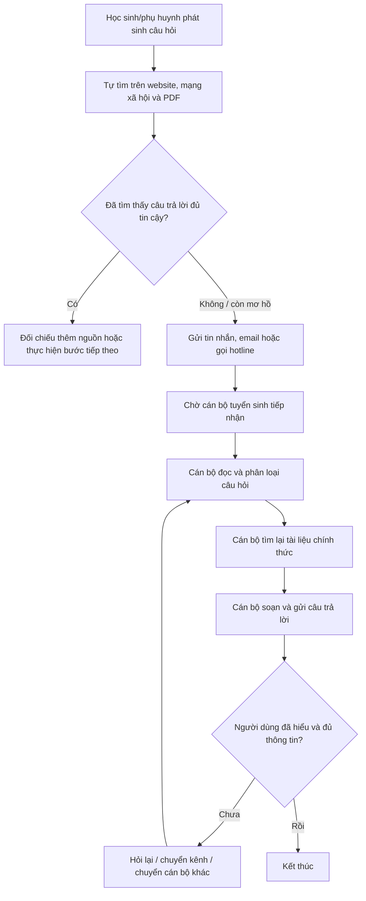
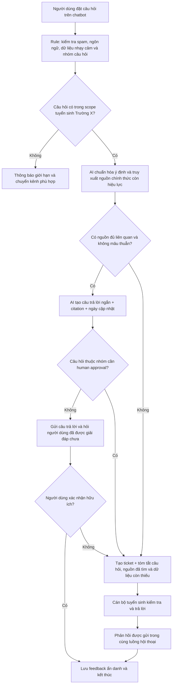
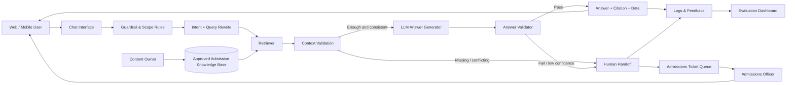

# Group Report — Day 02

## Chủ đề nhóm lựa chọn

**Trợ lý tuyển sinh AI — hỗ trợ học sinh, phụ huynh tra cứu thông tin tuyển sinh chính thức 24/7 và giảm tải câu hỏi lặp lại cho cán bộ tuyển sinh.**

> **Nguồn ý tưởng:** Chủ đề Top 1 của thành viên Nguyễn Hoàng Biên.  
> **Phạm vi giả định:** Một cơ sở đào tạo cụ thể, gọi là **Trường X**, trong một mùa tuyển sinh xác định.  
> **Lưu ý về số liệu:** Nhóm chưa có log vận hành trực tiếp của Trường X. Các con số thời gian và target trong báo cáo là giả thuyết ban đầu để thiết kế pilot, không phải số liệu đã được xác nhận. Trước khi triển khai thật cần đo baseline bằng log, phỏng vấn và survey.

---

## Thành viên nhóm

| STT | Họ và tên | Mã học viên | Vai trò trong artifact nhóm |
|---:|---|---|---|
| 1 | Nguyễn Hoàng Biên | 2A202601233 | Problem owner; trình bày pain point tuyển sinh và bối cảnh người dùng |
| 2 | Vũ Tú Quỳnh | 2A202601239 | Phân tích workflow, metric và tổng hợp `group-report.md` |
| 3 | Trần Thị Ngọc Lan | 2A202601385 | Gom nhóm candidates, shortlist và so sánh phương án thay thế |
| 4 | Nguyễn Đặng Kỳ Anh | 2A202601501 | Research giải pháp hiện có, rủi ro dữ liệu và độ chính xác |
| 5 | Nguyễn Ngọc Nam | 2A202601561 | Boundary, human handoff, pilot và quyết định cuối |

---

# 1. Tóm tắt vấn đề được chọn

## 1.1. Tác vụ lặp lại

Trong mùa tuyển sinh, cán bộ phải trả lời lặp đi lặp lại các câu hỏi như:

- Học phí của từng ngành.
- Phương thức xét tuyển.
- Điều kiện và hồ sơ đăng ký.
- Điểm chuẩn các năm trước.
- Chính sách học bổng.
- Thời hạn đăng ký và các mốc quan trọng.
- Cách điều chỉnh, bổ sung hoặc theo dõi hồ sơ.

Dù người dùng diễn đạt theo nhiều cách khác nhau, phần lớn câu trả lời nằm trong cùng một tập website, thông báo và tài liệu PDF chính thức. Cán bộ vẫn phải đọc câu hỏi, xác định ý định, tìm lại tài liệu và viết câu trả lời gần giống nhau cho từng người.

## 1.2. Tiêu tốn thời gian

Học sinh và phụ huynh phải tự tìm, đọc và đối chiếu thông tin từ nhiều nguồn. Thông tin có thể nằm ở:

- Website chính của trường.
- Trang tuyển sinh riêng.
- Bài đăng mạng xã hội.
- File đề án tuyển sinh.
- File hướng dẫn đăng ký.
- Thông báo học phí, học bổng và lịch tuyển sinh.
- Cổng tuyển sinh của Bộ Giáo dục và Đào tạo.

Cán bộ tuyển sinh đồng thời phải xử lý tin nhắn trên nhiều kênh, tra cứu tài liệu thủ công và sàng lọc trường hợp cần tư vấn sâu. Khi số lượng câu hỏi tăng mạnh, hàng đợi kéo dài và phản hồi trở nên chậm hoặc thiếu nhất quán.

## 1.3. Lợi thế tiềm năng của AI

AI có thể hỗ trợ phần ngôn ngữ và truy xuất thông tin:

- Hiểu nhiều cách diễn đạt của cùng một câu hỏi.
- Tìm đoạn phù hợp trong tài liệu tuyển sinh chính thức.
- Tổng hợp câu trả lời dễ hiểu.
- Đính kèm nguồn, tên tài liệu, ngày hiệu lực và đường dẫn kiểm chứng.
- Duy trì ngữ cảnh trong một phiên hội thoại.
- Nhận diện câu hỏi chưa đủ dữ liệu để hỏi lại.
- Chuyển trường hợp phức tạp cho cán bộ kèm tóm tắt hội thoại.

Lợi thế này tốt hơn FAQ cố định trong các trường hợp người dùng không biết đúng từ khóa hoặc đặt câu hỏi kết hợp nhiều điều kiện. Tuy nhiên, AI không thể thay thế việc quản trị nội dung, xác định tài liệu còn hiệu lực hoặc phê duyệt quyết định tuyển sinh.

## 1.4. Điểm đau người dùng

### Học sinh và phụ huynh

Điểm đau lớn nhất xuất hiện khi họ cần xác nhận thông tin vào buổi tối, cuối tuần hoặc sát hạn đăng ký nhưng không nhận được phản hồi kịp thời. Hậu quả có thể là:

- Hoang mang vì nhiều nguồn có nội dung khác nhau.
- Hiểu sai điều kiện xét tuyển.
- Chuẩn bị thiếu hồ sơ.
- Thực hiện sai bước.
- Bỏ lỡ thời hạn hoặc cơ hội học bổng.
- Phải hỏi lại trên nhiều kênh để tìm câu trả lời chắc chắn.

### Cán bộ tuyển sinh

Điểm đau lớn nhất là phải xử lý số lượng lớn câu hỏi giống nhau trong mùa cao điểm:

- Mất thời gian cho việc tra cứu và gõ lại câu trả lời.
- Khó duy trì thời gian phản hồi ổn định.
- Có thể trả lời khác nhau giữa các cán bộ hoặc giữa các kênh.
- Dễ kiệt sức vì công việc lặp lại.
- Không còn đủ thời gian cho ứng viên có trường hợp đặc biệt hoặc cần tư vấn chuyên sâu.

---

# 2. Group Convergence

## 2.1. Danh sách candidates từ các thành viên

| # | Người đưa ra | Candidate problem | Người gặp vấn đề | Điểm nghẽn chính | Cảm nhận nhanh |
|---:|---|---|---|---|---|
| 1 | Nguyễn Hoàng Biên | Câu hỏi tuyển sinh lặp lại và phản hồi chậm | Học sinh, phụ huynh, cán bộ tuyển sinh | Cán bộ đọc, tra cứu và trả lời thủ công trên nhiều kênh | Workflow rõ, dữ liệu chính thức có thể tập hợp |
| 2 | Vũ Tú Quỳnh | Không kết nối được tổng đài ngân hàng | Khách hàng ngân hàng | Phải gọi lại nhiều lần vì đường dây bận | Pain mạnh nhưng khó tiếp cận data và có rủi ro nghiệp vụ cao |
| 3 | Vũ Tú Quỳnh | Giáo viên trả lời lặp lại về lịch học, deadline và bài tập | Giáo viên, học viên | Thông tin nằm rải rác, cùng câu hỏi lặp lại | Dễ pilot nhưng impact hẹp hơn |
| 4 | Vũ Tú Quỳnh | Nhân viên mới phải hỏi nhiều người về quy trình nội bộ | Nhân viên mới, mentor | Không biết đúng tài liệu hoặc người cần hỏi | Phù hợp semantic search nhưng cần quyền truy cập nội bộ |
| 5 | Trần Thị Ngọc Lan | HR mất nhiều thời gian đọc và lọc CV | HR, ứng viên | Đọc nhiều CV và đối chiếu tiêu chí thủ công | Impact rõ nhưng có bias và fairness risk |
| 6 | Trần Thị Ngọc Lan | Sinh viên khó chọn môn phù hợp với lộ trình | Sinh viên, cố vấn học tập | Phải đối chiếu tiên quyết, lịch học và mục tiêu | Có thể dùng rule trước; cá nhân hóa phức tạp |
| 7 | Trần Thị Ngọc Lan | Người mua khó so sánh tổng giá giữa các sàn | Người mua hàng | Giá, voucher và phí vận chuyển thay đổi theo sàn | Data động, khó tích hợp ổn định |
| 8 | Nguyễn Đặng Kỳ Anh | Người dùng nhiều thuốc khó hiểu cách dùng và tác dụng phụ | Bệnh nhân, người chăm sóc | Thông tin khó hiểu, phân tán và có rủi ro dùng sai | Impact lớn nhưng high-stakes, cần chuyên gia y tế |
| 9 | Nguyễn Đặng Kỳ Anh | Người học bị quá tải thông tin khóa học | Học viên | Không biết nội dung nào liên quan đến mục tiêu | Cần thu hẹp actor và workflow |
| 10 | Nguyễn Đặng Kỳ Anh | Tổng hợp tiến độ nhóm hằng ngày | Thành viên và trưởng nhóm | Thu thập update và viết lại thủ công | Dễ làm nhưng impact thấp hơn |
| 11 | Nguyễn Ngọc Nam | Khó theo dõi dinh dưỡng bệnh nhân ngoại trú | Bệnh nhân, bác sĩ, chuyên gia dinh dưỡng | Thiếu dữ liệu liên tục và không thể theo dõi sát từng người | Impact cao nhưng scope và rủi ro y tế quá lớn cho lab |

## 2.2. Gom trùng / cluster

| Cluster | Candidates included | Pattern chung | Ghi chú |
|---|---|---|---|
| A — Hỏi đáp và tìm kiếm thông tin | Tuyển sinh, lịch học/deadline, quy trình nhân viên mới, thông tin thuốc, quá tải thông tin khóa học | Người dùng đặt câu hỏi tự nhiên nhưng thông tin nằm trong nhiều tài liệu | Có thể dùng search, FAQ, semantic retrieval hoặc RAG |
| B — Hỗ trợ người dùng quá tải | Tổng đài ngân hàng, tư vấn tuyển sinh | Nhiều người cần hỗ trợ cùng lúc nhưng số nhân sự có hạn | Cần queue, self-service và human handoff |
| C — Lựa chọn / recommendation | Lọc CV, chọn môn, so sánh giá, dinh dưỡng ngoại trú | Phải kết hợp nhiều điều kiện để đưa ra lựa chọn | Có rủi ro bias hoặc hậu quả cao nếu tự quyết |
| D — Tổng hợp / báo cáo | Update tiến độ nhóm | Thu thập nhiều update rồi tổng hợp theo format | Workflow đơn giản, dễ dùng template và automation |

## 2.3. Shortlist

| Candidate | Vì sao vào shortlist | Rủi ro / điều chưa rõ |
|---|---|---|
| Trợ lý tuyển sinh AI | Actor cụ thể; workflow lặp lại; nguồn chính thức tồn tại; dễ vẽ before/after; có thể pilot tại một trường | Chưa có log thật; thông tin thay đổi theo mùa; hallucination có thể gây hậu quả |
| Hỗ trợ tổng đài ngân hàng | Pain rõ và cấp bách; impact lớn; có thể đo số lần gọi và thời gian chờ | Khó tiếp cận dữ liệu; liên quan xác thực và tài chính; nhiều phần cần process fix hơn AI |
| Lọc CV cho HR | Tần suất cao; tiết kiệm thời gian; có thể đo thời gian đọc CV | Bias, quyền riêng tư, tiêu chí tuyển dụng không rõ; AI không nên tự loại ứng viên |
| Tra cứu cách dùng thuốc | Người dùng có pain thật; thông tin cần được diễn giải dễ hiểu | High-stakes; cần dữ liệu y tế chính xác và chuyên gia phê duyệt; không phù hợp pilot nhanh |

## 2.4. Score để đồng thuận

Chấm theo thang 1–5. Điểm số chỉ dùng để hỗ trợ thảo luận, không đại diện cho bằng chứng định lượng.

| Candidate | Actor rõ | Workflow rõ | Pain có evidence ban đầu | Impact đo được | Làm trong lab | So sánh R/W/A được | Nhóm hiểu domain | Tổng |
|---|---:|---:|---:|---:|---:|---:|---:|---:|
| Trợ lý tuyển sinh AI | 5 | 5 | 4 | 5 | 5 | 5 | 5 | **34** |
| Tổng đài ngân hàng | 5 | 5 | 4 | 5 | 3 | 4 | 4 | **30** |
| Lọc CV cho HR | 5 | 4 | 3 | 4 | 4 | 4 | 3 | **27** |
| Tra cứu cách dùng thuốc | 5 | 4 | 4 | 5 | 2 | 4 | 2 | **26** |

### Candidate nhóm chọn

**Trợ lý tuyển sinh AI của Trường X.**

### Vì sao chọn

- Actor chính và actor vận hành đều rõ.
- Workflow hiện tại có thể quan sát và vẽ được.
- Câu hỏi lặp lại có nội dung nằm trong tập tài liệu chính thức.
- Có thể giới hạn pilot vào một trường, một mùa tuyển sinh và một số nhóm câu hỏi.
- Có thể kết hợp No AI, Rule và AI Workflow thay vì bắt buộc làm Agent.
- Impact có thể đo bằng thời gian phản hồi, tỷ lệ câu hỏi tự phục vụ, độ chính xác và số case phải chuyển cán bộ.
- Hậu quả AI sai có thể giảm bằng citation, confidence threshold, scope hẹp và human handoff.

### Vì sao chưa chọn các candidate còn lại

- **Tổng đài ngân hàng:** phần đau nhất là queue và callback; process fix có thể quan trọng hơn AI. Dữ liệu và tích hợp nghiệp vụ khó tiếp cận.
- **Lọc CV:** dễ tạo bias và ảnh hưởng trực tiếp tới cơ hội của ứng viên; cần governance và kiểm định fairness sâu hơn.
- **Thông tin thuốc:** sai sót có thể ảnh hưởng sức khỏe; không phù hợp với pilot ngắn khi chưa có chuyên gia y tế và nguồn dữ liệu được phê duyệt.
- **Các candidate còn lại:** hoặc impact nhỏ hơn, hoặc problem statement chưa đủ hẹp, hoặc cần dữ liệu động/tích hợp phức tạp.

### Cách xử lý disagreement

Nhóm không chọn chỉ bằng biểu quyết. Nhóm ưu tiên candidate có thể:

1. Mô tả actor và workflow cụ thể.
2. Đo baseline và target.
3. Thu hẹp thành pilot.
4. Có phương án non-AI.
5. Có human boundary rõ.
6. Tiếp cận được dữ liệu đầu vào.
7. Hạn chế hậu quả nếu AI trả lời sai.

---

# 3. Quick Validation

## 3.1. Trạng thái validation

Nhóm **chưa thực hiện phỏng vấn hoặc survey chính thức với cán bộ tuyển sinh của Trường X**. Do đó, nhóm không khẳng định các ước lượng về số câu hỏi, thời gian chờ hoặc mức giảm workload là số liệu thật.

Validation hiện có gồm:

- Quan sát vấn đề do thành viên đưa ra.
- Thảo luận và challenge trong nhóm.
- Desk research từ nguồn chính thức.
- Kiểm tra các trường hợp triển khai chatbot tuyển sinh tại Việt Nam và quốc tế.

## 3.2. Tín hiệu validation ban đầu

| Nguồn | Mẫu / phạm vi | Tín hiệu xác nhận | Tín hiệu phản bác / giới hạn | Nhóm sửa problem thế nào |
|---|---|---|---|---|
| Thảo luận nội bộ nhóm | 5 thành viên | Nhóm thống nhất đây là workflow dễ hiểu và có thể pilot | Không thay thế được phỏng vấn actor thật | Ghi rõ baseline là giả định và cần đo trước pilot |
| Quy chế tuyển sinh 2026 của Bộ GDĐT | Nguồn quản lý chính thức | Thông tin tuyển sinh có quy định, mốc thời gian và thay đổi theo năm | Quy chế chung không thay thế đề án của từng trường | Chỉ trả lời từ nguồn chính thức, có năm tuyển sinh và ngày hiệu lực |
| Các chatbot tuyển sinh của trường đại học | UEF, HCMUTE, UTT, Đại học Tây Bắc | Mô hình chatbot tuyển sinh 24/7 đã được triển khai trong thực tế | Website công bố tính năng không chứng minh toàn bộ hiệu quả | Không claim hiệu quả nếu không có số liệu; dùng như bằng chứng về pattern giải pháp |
| Georgia State Pounce | Case đại học quốc tế | Chatbot được dùng cho hoạt động tuyển sinh và hỗ trợ số lượng lớn tương tác | Khác bối cảnh Việt Nam, kênh và quy trình khác | Chỉ lấy bài học về scale, nhắc việc và human capacity |
| Tài liệu Microsoft Copilot Studio | Pattern kỹ thuật | Có thể giới hạn nguồn tri thức, đánh dấu nguồn chính thức và trả lời theo knowledge source | Tool không tự bảo đảm dữ liệu đúng hoặc còn hiệu lực | Data governance và source approval là phần bắt buộc của workflow |

## 3.3. Các câu hỏi cần phỏng vấn trước khi production

### Với học sinh / phụ huynh

1. Lần gần nhất bạn cần hỏi thông tin tuyển sinh là khi nào?
2. Bạn tìm thông tin ở những kênh nào?
3. Bạn mất bao lâu để có câu trả lời mà bạn tin tưởng?
4. Loại câu hỏi nào khiến bạn phải hỏi cán bộ?
5. Bạn có tin câu trả lời của chatbot nếu có nguồn và ngày cập nhật không?
6. Khi chatbot không chắc, bạn muốn được chuyển sang kênh nào?

### Với cán bộ tuyển sinh

1. Một ngày cao điểm có khoảng bao nhiêu câu hỏi?
2. Nhóm câu hỏi nào lặp lại nhiều nhất?
3. Median và P90 response time hiện tại là bao nhiêu?
4. Cán bộ mất bao lâu để xử lý một câu hỏi phổ biến?
5. Những câu hỏi nào tuyệt đối phải do người thật trả lời?
6. Tài liệu nào là source of truth?
7. Ai chịu trách nhiệm xác nhận tài liệu còn hiệu lực?
8. Những sai sót nào được coi là critical?

## 3.4. Problem được chỉnh sau validation ban đầu

Ban đầu ý tưởng có xu hướng rộng: **“chatbot tư vấn tuyển sinh và cá nhân hóa lộ trình cho mọi thí sinh.”**

Sau khi challenge, nhóm thu hẹp thành:

> **Hỗ trợ trả lời các câu hỏi thông tin tuyển sinh phổ biến của một trường, trong một mùa tuyển sinh, dựa trên tập nguồn chính thức được duyệt; câu hỏi thiếu dữ liệu, cần quyết định nghiệp vụ hoặc có rủi ro cao phải được chuyển cho cán bộ.**

Nhóm không đưa “dự đoán đỗ”, “chọn trường thay người dùng” hoặc “tự nộp hồ sơ” vào scope pilot.

---

# 4. Research giải pháp hiện có

## 4.1. Nguồn và case tham khảo

| Nguồn / tool / case | Link | Họ giải quyết phần nào? | Điểm mạnh | Khoảng trống / rủi ro | Bài học cho nhóm |
|---|---|---|---|---|---|
| Quy chế tuyển sinh đại học 2026 — Bộ GDĐT | https://moet.gov.vn/tin-tuc/tin-tong-hop2/ban-hanh-quy-che-tuyen-sinh-dai-hoc-nam-2026.html | Cung cấp khung quy định tuyển sinh chính thức | Nguồn có thẩm quyền, xác định quy tắc và mốc chung | Không chứa toàn bộ chính sách riêng của Trường X | Bot phải phân biệt quy định Bộ và đề án riêng của trường |
| Cổng thông tin tuyển sinh — Bộ GDĐT | https://tuyensinh.moet.gov.vn/ | Cung cấp thông tin, văn bản và hệ thống tuyển sinh chung | Nguồn chính thức cho quy trình cấp quốc gia | Nội dung nhiều lớp, người dùng vẫn phải tìm đúng trang | Retrieval cần giữ URL gốc và ngày hiệu lực |
| UEF Admission AI ChatBot | https://www.uef.edu.vn/tin-tuyen-sinh/uef-ra-mat-uef-admission-ai-chatbot-tro-ly-tu-van-huong-nghiep-tuyen-sinh-thong-minh-2026-34346 | Hỏi đáp ngành học, phương thức xét tuyển, học bổng, học phí và mốc thời gian | Case Việt Nam gần với problem nhóm | Thông tin công bố không đủ để kết luận accuracy hoặc workload reduction | Scope chức năng có thể bắt đầu từ các nhóm câu hỏi phổ biến |
| HCMUTE Chatbot tuyển sinh | https://chatbot.hcmute.edu.vn/ | Tư vấn thông tin tuyển sinh trên website trường | Thể hiện chatbot là một kênh self-service có thể triển khai trực tiếp | Không biết quy trình cập nhật nguồn và escalation | Cần quan sát cả UI, citation, fallback chứ không chỉ có chatbot |
| UTT AI Chatbot | https://chatbot.utt.edu.vn/ | Trợ lý ảo hỏi đáp tuyển sinh | Pattern triển khai trực tiếp cho thí sinh | Chưa có evidence công khai về metric chất lượng | Pilot phải có evaluation set và log feedback |
| Georgia State — Pounce Admissions chatbot | https://news.gsu.edu/2017/11/01/georgia-state-wins-excalibur-award-for-deployment-of-innovative-admissions-technology/ | Trả lời câu hỏi và gửi nhắc việc cho sinh viên mới | Case thực tế về hỗ trợ tuyển sinh và enrollment ở quy mô lớn | Khác bối cảnh, quy định và kênh giao tiếp tại Việt Nam | Chatbot có thể giảm tải thông tin lặp lại nhưng cần nội dung và campaign được quản trị |
| Georgia State — scale của Pounce | https://news.gsu.edu/2024/01/11/national-institute-for-student-success-awarded-7-6-million-grant-by-u-s-department-of-education/ | Hỗ trợ lượng lớn tương tác và sinh viên | Cho thấy self-service có thể mở rộng hơn nhân sự thủ công | Không thể lấy nguyên metric để áp cho Trường X | Không dùng số liệu case ngoài làm target trực tiếp; chỉ dùng làm benchmark pattern |
| Microsoft Copilot Studio — knowledge sources | https://learn.microsoft.com/en-us/microsoft-copilot-studio/knowledge-copilot-studio | Quản lý nguồn tri thức và đánh dấu official source | Có pattern phân loại nguồn được xác minh | Official flag không tự bảo đảm tài liệu còn hiệu lực | Mỗi source vẫn cần owner, version và review date |
| Microsoft Copilot Studio — selected knowledge sources | https://learn.microsoft.com/en-us/microsoft-copilot-studio/nlu-boost-node | Giới hạn một câu hỏi vào tập nguồn cụ thể | Giảm việc dùng nguồn ngoài scope; phù hợp câu hỏi nhạy cảm | Retrieval vẫn có thể chọn sai đoạn hoặc tóm tắt sai | Với học phí, deadline, điều kiện cần search trong nguồn được chỉ định và có fallback |

## 4.2. Research takeaway

1. **Đã có giải pháp chatbot tuyển sinh**, nên nhóm không giả định đây là ý tưởng hoàn toàn mới.
2. Giá trị không nằm ở việc “có chatbot”, mà ở:
   - nguồn có đúng và còn hiệu lực không,
   - bot có dẫn nguồn không,
   - khi nào bot phải từ chối,
   - handoff có giữ context không,
   - có đo được accuracy và workload reduction không.
3. FAQ hoặc rule có thể giải phần câu hỏi rất cố định.
4. AI hữu ích nhất ở bước hiểu cách hỏi đa dạng, truy xuất ngữ nghĩa và diễn giải lại.
5. Agent tự hành động không cần thiết trong pilot vì workflow tuyến tính và hậu quả của hành động sai cao.
6. Data governance là điều kiện bắt buộc, không phải phần phụ sau khi đã build bot.

---

# 5. Current Workflow

## 5.1. Workflow hiện tại dạng sơ đồ



## 5.2. Chi tiết từng bước

Các con số là ước tính để hình thành baseline giả thuyết và phải được kiểm chứng.

| Bước | Actor | Input | Output | Thời gian / tần suất ước tính | Handoff / ghi chú |
|---:|---|---|---|---|---|
| 1 | Học sinh / phụ huynh | Nhu cầu về ngành, hồ sơ, học phí, học bổng hoặc deadline | Câu hỏi ban đầu | Phát sinh bất kỳ lúc nào | Có thể phát sinh ngoài giờ |
| 2 | Học sinh / phụ huynh | Câu hỏi và nhiều nguồn công khai | Một số trang hoặc file có vẻ liên quan | 10–30 phút/case | Người dùng phải tự đoán từ khóa |
| 3 | Học sinh / phụ huynh | Kết quả tìm kiếm chưa chắc chắn | Tin nhắn, email hoặc cuộc gọi | 1–5 phút | Cùng một câu hỏi có thể gửi nhiều kênh |
| 4 | Hệ thống/kênh liên lạc | Yêu cầu của người dùng | Hàng đợi cho cán bộ | Vài phút đến nhiều giờ; ngoài giờ có thể sang ngày làm việc sau | **Bottleneck về thời gian chờ** |
| 5 | Cán bộ tuyển sinh | Tin nhắn người dùng | Ý định được xác định | 1–3 phút/case | Câu hỏi có thể thiếu thông tin |
| 6 | Cán bộ tuyển sinh | Ý định và tập tài liệu | Nguồn hoặc đoạn trả lời | 3–10 phút/case | **Bottleneck về tra cứu thủ công** |
| 7 | Cán bộ tuyển sinh | Thông tin đã tìm | Câu trả lời gửi người dùng | 2–5 phút/case | Dễ lặp lại giữa nhiều người |
| 8 | Học sinh / phụ huynh và cán bộ | Câu trả lời đầu tiên | Follow-up hoặc kết thúc | 5–15 phút nếu hỏi lại | Context có thể mất khi đổi kênh/cán bộ |

## 5.3. Bottleneck chính

Có hai bottleneck liên kết với nhau:

### Bottleneck 1 — Chờ cán bộ tiếp nhận

Trong mùa cao điểm, nhiều câu hỏi đến đồng thời nhưng số cán bộ có hạn. Câu hỏi phổ biến và câu hỏi phức tạp cùng nằm trong một hàng đợi.

### Bottleneck 2 — Cán bộ tra cứu và viết lại câu trả lời

Ngay cả khi nội dung đã có trong tài liệu, cán bộ vẫn phải:

1. Hiểu cách diễn đạt của người dùng.
2. Xác định tài liệu phù hợp.
3. Kiểm tra thông tin còn hiệu lực.
4. Viết lại theo ngữ cảnh.
5. Trả lời follow-up.

Phần này lặp lại và chiếm thời gian đáng kể, làm hàng đợi tiếp tục tăng.

## 5.4. Impact hiện tại

### Đối với học sinh và phụ huynh

- Không có phản hồi tức thì ngoài giờ.
- Mất thời gian tìm và đối chiếu nhiều nguồn.
- Dễ tin thông tin cũ hoặc không chính thức.
- Có thể bỏ lỡ deadline hoặc chuẩn bị sai hồ sơ.
- Phải kể lại câu hỏi khi chuyển kênh.

### Đối với Trường X

- Cán bộ dành phần lớn thời gian cho câu hỏi phổ biến.
- Thời gian phản hồi tăng trong cao điểm.
- Nội dung trả lời có thể không đồng nhất.
- Khó ưu tiên case cần tư vấn thật.
- Không có dữ liệu tập trung về chủ đề người dùng quan tâm hoặc tài liệu gây hiểu nhầm.

---

# 6. Future Workflow

## 6.1. Workflow sau tối ưu



## 6.2. Vai trò của từng thành phần

| Bước | Rule / AI / Human | Chức năng |
|---|---|---|
| Kiểm tra scope và dữ liệu nhạy cảm | Rule | Không cần LLM tự quyết các điều kiện cố định |
| Phân loại nhóm câu hỏi | Rule + AI | Rule cho keyword rõ; AI cho cách diễn đạt đa dạng |
| Retrieval | Workflow + search/embedding | Tìm trong tập nguồn đã duyệt, lọc theo năm và trạng thái hiệu lực |
| Tạo câu trả lời | AI | Diễn giải dễ hiểu nhưng không được thêm claim ngoài nguồn |
| Citation | Rule / application logic | Luôn hiển thị link, tên nguồn, ngày cập nhật |
| Confidence và conflict check | Rule + evaluation | Không trả lời khi thiếu nguồn hoặc nguồn mâu thuẫn |
| Handoff | Workflow | Tạo ticket kèm full context, không bắt người dùng kể lại |
| Phê duyệt case rủi ro cao | Human | Cán bộ chịu trách nhiệm cuối |
| Cập nhật knowledge base | Human owner | Xác nhận nguồn mới, hết hiệu lực hoặc thay đổi |
| Theo dõi metric | Analytics | Đo accuracy, deflection, response time và escalation |

## 6.3. Human boundary

AI **được phép**:

- Trả lời câu hỏi thông tin phổ biến có nguồn rõ.
- Tóm tắt một hoặc nhiều đoạn từ nguồn chính thức.
- Hỏi lại để làm rõ chương trình, năm tuyển sinh hoặc loại hồ sơ.
- Hướng dẫn người dùng mở đúng trang hoặc chuẩn bị checklist tham khảo.
- Tóm tắt hội thoại cho cán bộ.

AI **không được phép**:

- Cam kết thí sinh chắc chắn trúng tuyển.
- Tự dự báo cơ hội trúng tuyển trong pilot.
- Tự quyết định hồ sơ hợp lệ hoặc không hợp lệ.
- Thay hội đồng hoặc cán bộ đưa ra quyết định tuyển sinh.
- Tự sửa, nộp hoặc rút hồ sơ.
- Tự thực hiện thanh toán.
- Trả lời từ kiến thức chung khi không có nguồn của Trường X.
- Dùng tài liệu cũ, dự thảo hoặc chưa được duyệt như source of truth.
- Thu thập dữ liệu cá nhân không cần thiết.
- Tiếp tục trả lời khi các nguồn chính thức mâu thuẫn.

## 6.4. Fallback

Chatbot phải chuyển người thật khi:

- Không tìm được nguồn đạt ngưỡng liên quan.
- Nguồn có nội dung mâu thuẫn.
- Câu hỏi liên quan trường hợp cá nhân đặc biệt.
- Người dùng muốn khiếu nại hoặc xác nhận quyết định.
- Câu hỏi liên quan thanh toán, hồ sơ đã nộp hoặc dữ liệu cá nhân.
- Người dùng đánh dấu câu trả lời không hữu ích.
- Có từ khóa khẩn cấp như “hôm nay hết hạn”, “đã thanh toán nhưng lỗi”, “không thấy hồ sơ”.
- AI không xác định được năm tuyển sinh hoặc chương trình.

Handoff phải gửi cho cán bộ:

- Câu hỏi gốc.
- Tóm tắt lịch sử hội thoại.
- Nhóm intent dự đoán.
- Các nguồn AI đã kiểm tra.
- Lý do escalation.
- Dữ liệu còn thiếu cần hỏi người dùng.

---

# 7. Before / After Impact

## 7.1. Metric so sánh

| Metric | Trước | Sau kỳ vọng trong pilot | Cách đo / ghi chú |
|---|---|---|---|
| Khả năng phản hồi ngoài giờ | Không có phản hồi tức thì từ cán bộ | Chatbot phản hồi bước đầu 24/7 | Log timestamp |
| Median first response time | Chưa đo; có thể từ vài phút đến nhiều giờ | Dưới 15 giây với chatbot | P50 từ log |
| Tỷ lệ câu hỏi phổ biến được xử lý tự phục vụ | 0% hoặc chưa có kênh thống nhất | ≥70% trong tập nhóm câu hỏi pilot | Số phiên resolved không cần cán bộ / tổng phiên in-scope |
| Thời gian cán bộ xử lý câu hỏi phổ biến | Chưa đo; giả thuyết 5–15 phút/case | Giảm ít nhất 40% | Time study trước/sau |
| Câu trả lời có nguồn kiểm chứng | Không được chuẩn hóa giữa các kênh | 100% câu trả lời AI có citation | Audit log |
| Độ chính xác factual trên gold set | Chưa có benchmark | ≥95%; 0 critical error | Review bởi cán bộ tuyển sinh |
| Citation correctness | Chưa đo | ≥98% citation thực sự hỗ trợ claim | Manual evaluation |
| Tỷ lệ escalation đúng | Chưa có | ≥95% case high-risk được chuyển người thật | Test set + log |
| Số lần người dùng phải kể lại vấn đề | Có thể xảy ra khi đổi kênh | 0 lần khi handoff trong cùng hệ thống | Survey và ticket audit |
| Mức hài lòng | Chưa đo | ≥4/5 ở câu hỏi in-scope | Rating sau phiên |

## 7.2. Số bước

| Chỉ số | Current | Future |
|---|---:|---:|
| Số bước chính với câu hỏi phổ biến | 8 | 5 |
| Số bước cán bộ làm thủ công | 3–4 | 0 với case tự phục vụ; 1 với case handoff |
| Nguồn người dùng phải tự đọc | Nhiều, không cố định | 1–3 nguồn được trích dẫn |
| Bước nghẽn | Chờ cán bộ + tra cứu thủ công | Review case ngoại lệ |
| Risk mới | Thông tin rời rạc, trả lời không đồng nhất | Hallucination, retrieval sai, source hết hiệu lực |

## 7.3. Bottleneck mới

Bottleneck sau tối ưu chuyển từ **mọi câu hỏi đều cần cán bộ** sang **cán bộ chỉ review case không chắc chắn hoặc có rủi ro**.

Đây là bottleneck chấp nhận được vì:

- Con người được tập trung vào case cần phán đoán.
- Queue nhỏ hơn.
- Cán bộ nhận sẵn context.
- AI không tự xử lý quyết định có hậu quả cao.

---

# 8. Data và Content Governance

## 8.1. Tập nguồn được phép dùng

Pilot chỉ index:

- Đề án tuyển sinh chính thức của Trường X.
- Thông báo tuyển sinh của đúng năm.
- Trang ngành học và chương trình đào tạo đã được duyệt.
- Bảng học phí và chính sách học bổng chính thức.
- Hướng dẫn hồ sơ và quy trình đăng ký.
- Lịch và deadline được công bố.
- FAQ do phòng tuyển sinh phê duyệt.
- Quy chế và cổng thông tin chính thức của Bộ GDĐT khi cần.

Không index:

- Bài viết chưa duyệt.
- Comment mạng xã hội.
- Nội dung của trung tâm tư vấn ngoài trường.
- Tài liệu dự thảo.
- File không có owner.
- Tài liệu không xác định năm hoặc ngày hiệu lực.
- Nội dung người dùng upload không được kiểm chứng.

## 8.2. Metadata bắt buộc

Mỗi document hoặc chunk cần có:

| Metadata | Mục đích |
|---|---|
| `source_id` | Truy vết tài liệu |
| `title` | Hiển thị citation |
| `source_url` / `file_path` | Mở nguồn gốc |
| `admission_cycle` | Tránh trộn năm |
| `program_scope` | Đại học, sau đại học hoặc chương trình cụ thể |
| `effective_from` | Ngày bắt đầu hiệu lực |
| `effective_to` | Ngày hết hiệu lực nếu có |
| `status` | Draft / approved / expired |
| `owner` | Người chịu trách nhiệm nội dung |
| `last_reviewed_at` | Kiểm soát freshness |
| `supersedes` | Xác định tài liệu thay thế bản cũ |
| `access_level` | Công khai hoặc nội bộ |

## 8.3. Quy trình cập nhật

```text
Phòng tuyển sinh tạo/cập nhật tài liệu
→ Content owner kiểm tra nội dung
→ Đánh dấu Approved + năm + ngày hiệu lực
→ Hệ thống index phiên bản mới
→ Chạy regression test trên bộ câu hỏi liên quan
→ Nếu pass, publish vào chatbot
→ Phiên bản cũ chuyển Expired và không được retrieval
```

Nếu không có bước này, chatbot có thể trả lời rất tự tin nhưng dựa trên tài liệu cũ.

---

# 9. Problem Statement v0

| Field | Nội dung |
|---|---|
| Actor | Học sinh, phụ huynh cần thông tin và cán bộ tuyển sinh của Trường X |
| Workflow | Người dùng tự tìm nhiều nguồn; nếu chưa chắc thì gửi tin nhắn hoặc gọi; cán bộ đọc, tra cứu tài liệu, trả lời và xử lý follow-up |
| Bottleneck | Hàng đợi phản hồi và bước cán bộ tra cứu, viết lại các câu trả lời lặp lại |
| Impact | Người dùng chờ lâu và có nguy cơ hiểu sai; cán bộ quá tải và thiếu thời gian cho tư vấn chuyên sâu |
| Success Metric | Trả lời nhanh hơn, giảm tải cho cán bộ và tăng sự hài lòng |
| Boundary | Chatbot chỉ tư vấn thông tin và chuyển câu hỏi khó cho cán bộ |

## 9.1. Điểm còn yếu của v0

- Actor còn gộp nhiều nhóm người.
- “Nhanh hơn” và “giảm tải” chưa có cách đo.
- Chưa chỉ rõ nguồn nào được phép dùng.
- Chưa định nghĩa câu hỏi khó hoặc high-risk.
- Chưa có accuracy và citation metric.
- Chưa ghi rõ năm tuyển sinh.
- Chưa có rollback khi AI sai.

---

# 10. Problem Statement v1

| Field | Nội dung |
|---|---|
| **Actor** | Học sinh lớp 12 và phụ huynh đang tìm hiểu hoặc chuẩn bị hồ sơ cho một mùa tuyển sinh cụ thể của Trường X; actor vận hành là cán bộ phòng tuyển sinh |
| **Workflow** | Người dùng tìm thông tin trên nhiều website/PDF; nếu chưa chắc thì gửi câu hỏi; cán bộ tiếp nhận, xác định intent, tìm nguồn chính thức, trả lời và xử lý follow-up |
| **Bottleneck** | Mọi câu hỏi, kể cả câu phổ biến, đều phải chờ cán bộ; cán bộ tiếp tục mất thời gian tra cứu và viết lại thông tin đã có trong tài liệu |
| **Impact** | Người dùng không có hỗ trợ tức thì ngoài giờ, có thể dùng nhầm thông tin hoặc bỏ lỡ mốc quan trọng; cán bộ quá tải và không đủ thời gian cho case cần tư vấn sâu |
| **Baseline** | Chưa có log; hiện xem như 0% câu hỏi được AI self-service, 100% case gửi vào kênh tư vấn cần người đọc; P50/P90 response time và handling time phải đo trong ít nhất một tuần |
| **Success Metric** | Trong pilot: first response dưới 15 giây; ≥70% câu hỏi in-scope được self-service; factual accuracy ≥95% trên gold set; citation correctness ≥98%; 0 critical error; thời gian cán bộ cho câu hỏi phổ biến giảm ≥40%; CSAT ≥4/5 |
| **Boundary** | Chỉ một Trường X, một mùa tuyển sinh, nguồn approved; không dự đoán đỗ, không phê duyệt hồ sơ, không nộp hồ sơ, không thanh toán, không dùng nguồn ngoài; case thiếu nguồn, mâu thuẫn, cá nhân hoặc high-risk chuyển cán bộ |
| **AI intervention point** | Sau khi nhận câu hỏi và kiểm tra scope; trước bước cán bộ phải tự tìm tài liệu và viết câu trả lời |
| **Mức chọn** | Workflow: rule kiểm scope/rủi ro → retrieval nguồn chính thức → AI diễn giải + citation → confidence check → self-service hoặc human handoff |
| **Rủi ro & người thật kiểm tra** | Hallucination, dùng nguồn hết hiệu lực, citation không hỗ trợ claim, lộ dữ liệu cá nhân. Content owner duyệt nguồn; cán bộ review case escalated; QA audit mẫu câu trả lời và regression test khi cập nhật tài liệu |

## 10.1. Problem Statement 1 câu

> Trong mùa tuyển sinh, học sinh lớp 12 và phụ huynh của Trường X phải tự tìm nhiều nguồn hoặc chờ cán bộ trả lời các câu hỏi phổ biến, trong khi cán bộ phải tra cứu và viết lại cùng một tập thông tin; nhóm đề xuất pilot một workflow hỏi đáp từ nguồn chính thức có citation và human handoff, với mục tiêu xử lý tự phục vụ ít nhất 70% câu hỏi in-scope, factual accuracy tối thiểu 95% và không có lỗi nghiêm trọng về học phí, điều kiện hoặc deadline.

---

# 11. Ma trận độ phù hợp với AI

## 11.1. Bài toán nằm ở ô nào?

**Độ phức tạp trung bình — độ mơ hồ trung bình/cao.**

### Vì sao

- Input là câu hỏi tự nhiên, có nhiều cách diễn đạt.
- Output cần diễn giải theo ngữ cảnh, không chỉ trả một string cố định.
- Có nhiều nguồn tài liệu nhưng workflow vẫn tuyến tính.
- Không cần AI tự lập kế hoạch dài hoặc tự quyết hành động tiếp theo.
- Có đáp án đúng/sai tương đối rõ vì mọi claim phải khớp nguồn chính thức.
- Một số câu hỏi có nhiều cách trả lời dễ hiểu, nên phần diễn đạt có độ mơ hồ.
- Case ngoại lệ phải chuyển con người thay vì để AI tiếp tục tự xử lý.

Do đó, **Workflow có AI hỗ trợ** phù hợp hơn Agent.

---

# 12. So sánh No AI / Rule / Workflow / Agent

| Mức | Phương án cho bài toán nhóm | Khi nào đủ | Điểm mạnh | Rủi ro / giới hạn | Chọn? |
|---|---|---|---|---|---|
| **No AI / Process fix** | Gom tài liệu vào một portal, chuẩn hóa FAQ, chỉ định content owner, SLA trả lời và một kênh tư vấn thống nhất | Đủ nếu người dùng sẵn sàng tự đọc và số câu hỏi không quá lớn | Ít rủi ro hallucination; bắt buộc phải làm dù có AI | Người dùng vẫn phải biết từ khóa; không xử lý tốt cách hỏi đa dạng; vẫn cần cán bộ cho nhiều câu hỏi | **Bắt buộc làm nền tảng** |
| **Rule** | Menu, decision tree, intent cố định, template trả lời theo keyword | Đủ cho câu hỏi rất phổ biến và có cấu trúc rõ | Predictable, dễ audit, chi phí thấp | Không hiểu nhiều cách hỏi; cây hội thoại lớn và khó bảo trì; câu hỏi kết hợp dễ thất bại | **Dùng cho guardrail và case cố định** |
| **Workflow** | Rule kiểm scope → semantic retrieval → AI tạo câu trả lời có citation → threshold → handoff | Phù hợp khi nguồn rõ nhưng cách hỏi đa dạng và cần diễn giải | Cân bằng trải nghiệm, độ linh hoạt và kiểm soát; human boundary rõ | Retrieval/hallucination risk; cần evaluation và content governance | **Chọn** |
| **Agent** | Tự chọn công cụ, tự tìm nhiều nguồn ngoài, cá nhân hóa lộ trình, tạo checklist, theo dõi deadline và tự hành động | Chỉ cần khi hệ thống có nhiều nhiệm vụ động và được phép thực hiện hành động | Có thể mở rộng nhiều use case | Quá rộng; permission, privacy và action risk cao; khó audit; chưa có nhu cầu trong pilot | **Không chọn** |

## 12.1. Mức được chọn

**Workflow.**

## 12.2. Vì sao chọn Workflow

- Các bước trước và sau AI xác định được.
- Rule đủ cho boundary, intent rủi ro và handoff.
- AI hữu ích ở semantic retrieval và diễn giải ngôn ngữ.
- Không cần tự lập kế hoạch hoặc tự hành động.
- Có thể log và đánh giá từng bước.
- Khi AI không chắc, workflow dừng và chuyển cán bộ.
- Có thể pilot thủ công trước khi tích hợp nhiều hệ thống.

## 12.3. Vì sao mức đơn giản hơn chưa đủ

No AI và Rule giải quyết được phần nền tảng nhưng chưa xử lý tốt:

- Nhiều cách hỏi cho cùng một nhu cầu.
- Câu hỏi kết hợp nhiều thông tin.
- Người dùng không biết đúng keyword.
- Nhu cầu diễn giải một đoạn quy định thành câu trả lời dễ hiểu.
- Duy trì context trong follow-up.

Tuy nhiên, nhóm không bỏ qua giải pháp đơn giản: portal, content governance, FAQ và rule là phần bắt buộc trong future workflow.

## 12.4. Vì sao không chọn Agent

Pilot không cần AI:

- Tự truy cập hệ thống hồ sơ.
- Tự sửa hoặc nộp đơn.
- Tự quyết định người dùng nên chọn ngành nào.
- Tự gửi nhắc việc không có phê duyệt.
- Tự tìm nguồn ngoài Internet.
- Tự thay đổi workflow theo mục tiêu mở.

Agent làm tăng scope, permission và rủi ro trong khi không giải quyết thêm bottleneck cốt lõi của pilot.

---

# 13. Risk Register

| Rủi ro | Mức độ | Ví dụ | Control |
|---|---|---|---|
| Hallucination | Cao | AI tự thêm điều kiện học bổng không có trong nguồn | Chỉ answer từ retrieved context; citation; gold-set evaluation; critical error gate |
| Dùng tài liệu cũ | Cao | Trả deadline của năm trước | Filter theo cycle/status/effective date; content owner; auto-expire |
| Citation sai | Cao | Link đúng chủ đề nhưng không hỗ trợ claim | Citation correctness test và audit |
| Nguồn mâu thuẫn | Cao | Website và PDF ghi hai mức học phí | Không tự chọn; cảnh báo và chuyển cán bộ |
| Người dùng hiểu câu trả lời như cam kết | Cao | “Em chắc chắn đủ điều kiện” | Ngôn ngữ boundary; cấm guarantee; human review cho eligibility |
| Privacy | Trung bình/Cao | Người dùng nhập CCCD, số hồ sơ hoặc thông tin tài chính | Data minimization, masking, consent, không lưu raw PII nếu chưa cần |
| Prompt injection từ tài liệu | Trung bình | Tài liệu chứa chuỗi hướng dẫn bot bỏ rule | Sanitize content; trusted source only; system guardrail |
| Retrieval sai ngành/chương trình | Trung bình | Hỏi sau đại học nhưng nhận thông tin đại học | Metadata filter, clarification question |
| Handoff thất bại | Trung bình | Ticket thiếu context, người dùng phải hỏi lại | Lưu full conversation + summary + source checked |
| Bot overload / unavailable | Trung bình | Mùa cao điểm hệ thống chậm | Monitoring, rate limit, static FAQ fallback |
| Nội dung thiếu khả năng tiếp cận | Thấp/Trung bình | Câu trả lời dài, khó hiểu | Plain language, mobile-first, Vietnamese text quality |
| Automation bias của cán bộ | Trung bình | Cán bộ tin tóm tắt AI mà không kiểm nguồn | Hiển thị nguồn, đào tạo, audit và trách nhiệm rõ |

---

# 14. Final Decision

## 14.1. Checklist

| Câu hỏi | Yes / Not Yet / No | Ghi chú |
|---|---|---|
| Actor và workflow đã rõ chưa? | **Yes** | Đã xác định người hỏi, cán bộ và các bước before/after |
| Baseline và success metric đã đo được chưa? | **Not Yet** | Metric đã định nghĩa nhưng chưa có log thật |
| Có data/input đủ dùng chưa? | **Not Yet / Partial** | Nguồn công khai tồn tại; cần Trường X cung cấp và phê duyệt bộ tài liệu |
| Nếu AI sai, hậu quả có chấp nhận được không? | **Yes với boundary** | Chỉ trả thông tin, không tự hành động; critical case phải handoff |
| Có người review/owner vận hành không? | **Not Yet** | Pilot yêu cầu content owner và admissions owner được chỉ định |
| Có cách non-AI đơn giản hơn không? | **Yes** | Portal, FAQ, template và rule; các phần này phải làm trước/cùng pilot |
| Có thể pilot nhỏ mà không tích hợp hệ thống nhạy cảm không? | **Yes** | Web chatbot read-only với data mẫu và handoff thủ công |
| Có thể rollback không? | **Yes** | Chuyển về FAQ/search và cán bộ nếu quality gate không đạt |

## 14.2. Decision

# **GO cho pilot nhỏ; NOT YET cho production.**

## 14.3. Lý do

- Problem và workflow đủ rõ để thử nghiệm.
- Dữ liệu cần thiết có thể bắt đầu từ tài liệu chính thức.
- AI intervention point cụ thể.
- Không cần quyền thực hiện hành động nhạy cảm.
- Có thể thiết kế human handoff và rollback.
- Chi phí pilot thấp hơn triển khai đầy đủ.
- Tuy nhiên, production chỉ được xem xét sau khi có baseline, content owner và quality evaluation.

---

# 15. Pilot nhỏ nhất

## 15.1. Scope

- Một trường: Trường X.
- Một mùa tuyển sinh.
- Một kênh: web chatbot nội bộ hoặc trang thử nghiệm.
- 5–8 nhóm câu hỏi:
  1. Ngành và chương trình.
  2. Phương thức xét tuyển.
  3. Hồ sơ.
  4. Học phí.
  5. Học bổng.
  6. Deadline.
  7. Điểm chuẩn tham khảo.
  8. Thông tin liên hệ/handoff.
- 30–50 nguồn hoặc trang chính thức đã được duyệt.
- Không tích hợp hệ thống hồ sơ, thanh toán hoặc CRM ở vòng đầu.

## 15.2. Các giai đoạn

### Giai đoạn 0 — Đo baseline

- Thu log 1–2 tuần từ các kênh hiện tại.
- Gắn nhãn loại câu hỏi.
- Đo:
  - số câu hỏi/ngày,
  - tỷ lệ câu hỏi lặp lại,
  - first response time,
  - handling time,
  - số lần hỏi lại,
  - số case cần cán bộ chuyên sâu.

### Giai đoạn 1 — Chuẩn hóa dữ liệu

- Chỉ định content owner.
- Lập danh sách source of truth.
- Gắn metadata.
- Loại bỏ bản cũ và nội dung mâu thuẫn.
- Viết 30–50 FAQ rule cho câu hỏi cực phổ biến.

### Giai đoạn 2 — Prototype

```text
Người dùng nhập câu hỏi
→ Scope check
→ Retrieval top-k từ nguồn approved
→ AI tạo answer + citation
→ Confidence / conflict check
→ Trả lời hoặc handoff thủ công
```

### Giai đoạn 3 — Evaluation nội bộ

- Xây gold set 150–200 câu hỏi:
  - câu phổ biến,
  - paraphrase,
  - câu hỏi kết hợp,
  - câu thiếu dữ liệu,
  - câu out-of-scope,
  - câu có nguồn mâu thuẫn,
  - câu high-risk.
- Cán bộ tuyển sinh chấm:
  - factual correctness,
  - completeness,
  - citation correctness,
  - clarity,
  - escalation correctness.

### Giai đoạn 4 — Limited pilot

- Mở cho nhóm nhỏ người dùng.
- Luôn hiển thị đây là trợ lý AI.
- Có nút “Gặp cán bộ”.
- Log feedback và lỗi.
- Audit hằng ngày trong mùa pilot.

## 15.3. Quality gates

Pilot chỉ mở rộng khi đạt:

| Gate | Target |
|---|---:|
| Factual accuracy | ≥95% |
| Critical error | 0 |
| Citation correctness | ≥98% |
| High-risk escalation recall | ≥95% |
| Median response time | <15 giây |
| In-scope self-service resolution | ≥70% |
| CSAT | ≥4/5 |
| Manual handling time reduction | ≥40% |
| Tỷ lệ source hết hiệu lực được retrieval | 0% |

## 15.4. Critical error được định nghĩa là

- Sai deadline.
- Sai học phí hoặc học bổng.
- Sai điều kiện xét tuyển.
- Khẳng định chắc chắn trúng tuyển.
- Hướng dẫn thao tác có thể làm mất quyền lợi.
- Trích nguồn không liên quan nhưng tạo cảm giác đã được kiểm chứng.
- Để lộ dữ liệu cá nhân.
- Không escalation một case bắt buộc phải có người thật.

---

# 16. Exit, Rollback và điều kiện No-Go

## 16.1. Rollback

Chuyển một nhóm câu hỏi về FAQ hoặc cán bộ khi:

- Có một critical error được xác nhận.
- Source of truth đang mâu thuẫn.
- Citation correctness dưới target.
- Content owner chưa xác nhận tài liệu mới.
- Người dùng đánh dấu không hữu ích tăng mạnh.
- Hệ thống không thể xác định đúng năm tuyển sinh.

## 16.2. Hạ từ Workflow xuống Rule / Search

Hạ mức khi:

- Hơn 80% câu hỏi thực tế thuộc một danh sách cố định và template trả lời đáp ứng tốt.
- AI không cải thiện self-service so với FAQ/search.
- Cán bộ phải sửa hơn 50% nội dung của đa số câu trả lời.
- Chi phí evaluation và governance lớn hơn lợi ích.
- Người dùng chỉ muốn mở đúng link, không cần diễn giải.

## 16.3. No-Go production nếu

- Không có content owner.
- Không xác định được source of truth.
- Không có quyền sử dụng hoặc lưu dữ liệu.
- Không đạt 0 critical error trên evaluation set.
- Không có cơ chế handoff.
- Trường muốn bot tự phê duyệt hồ sơ hoặc cam kết kết quả.
- Không thể tách tài liệu theo năm tuyển sinh.
- Không thể audit câu trả lời và nguồn đã dùng.

---

# 17. Kiến trúc logic đề xuất

Đây là kiến trúc ở mức product workflow, không phải thiết kế kỹ thuật cuối cùng.



## 17.1. Nguyên tắc kiến trúc

- Read-only trong pilot.
- Không web search mở.
- Chỉ retrieve nguồn approved.
- Tách rule và AI.
- Mọi answer có trace tới source.
- Có observability.
- Có evaluation trước và sau update.
- Có fallback độc lập với LLM.

---

# 18. Measurement Plan

## 18.1. Event cần log

| Event | Trường dữ liệu chính |
|---|---|
| `question_received` | timestamp, session_id, channel, language |
| `intent_classified` | intent, confidence |
| `retrieval_completed` | source_ids, scores, cycle |
| `answer_generated` | answer_id, latency, model version |
| `answer_shown` | citation_ids, response time |
| `user_feedback` | helpful yes/no, rating |
| `handoff_created` | reason, queue, urgency |
| `human_answered` | handling time, resolution |
| `content_updated` | source_id, owner, old/new version |
| `quality_incident` | severity, category, root cause |

Không log raw PII trừ khi có mục đích, consent và chính sách lưu trữ rõ.

## 18.2. Evaluation dimensions

- **Correctness:** claim có đúng nguồn không?
- **Citation support:** citation có thực sự hỗ trợ claim không?
- **Completeness:** có bỏ sót điều kiện quan trọng không?
- **Freshness:** có dùng đúng năm và phiên bản không?
- **Clarity:** học sinh có hiểu được không?
- **Safety:** có cam kết, suy đoán hoặc thu thập dữ liệu không cần thiết không?
- **Escalation:** có chuyển đúng case không?
- **Operational value:** cán bộ có thực sự giảm effort không?

---

# 19. Assumptions và Open Questions

## 19.1. Assumptions

- Trường X có bộ tài liệu tuyển sinh số hóa.
- Phòng tuyển sinh có thể chỉ định owner.
- Phần lớn câu hỏi phổ biến có đáp án trong nguồn chính thức.
- Chatbot có thể được đặt trên một kênh do trường quản lý.
- Cán bộ có khả năng tiếp nhận ticket escalated.
- Người dùng chấp nhận câu trả lời AI nếu có nguồn rõ.
- Trường có thể lưu log ở mức phù hợp với chính sách dữ liệu.

## 19.2. Open questions

1. Tỷ lệ thật của các câu hỏi lặp lại là bao nhiêu?
2. Kênh nào có lưu lượng lớn nhất?
3. Trường X có CRM/ticket system không?
4. Ai là source owner của học phí, học bổng và deadline?
5. Khi hai thông báo mâu thuẫn, quy trình xử lý là gì?
6. Cần hỗ trợ tiếng Anh hay ngôn ngữ khác không?
7. Handoff cần SLA bao lâu?
8. Có được lưu lịch sử hội thoại không?
9. Có cần accessibility cho người dùng khuyết tật không?
10. Những claim nào bắt buộc cán bộ phê duyệt trước khi hiển thị?
11. Cách đo một phiên được “resolved” là gì?
12. Chi phí trên mỗi phiên có phù hợp với quy mô không?

---

# 20. Kết luận

Nhóm chọn bài toán trợ lý tuyển sinh vì pain point có actor rõ, workflow lặp lại, dữ liệu chính thức có thể khoanh vùng và impact có thể đo. Tuy nhiên, nhóm không xem “làm chatbot” là giải pháp đầy đủ.

Giải pháp cần bắt đầu từ:

1. Tập trung và chuẩn hóa nguồn.
2. Chỉ định content owner.
3. Tạo FAQ và rule cho case cố định.
4. Dùng AI ở bước hiểu câu hỏi, retrieval và diễn giải.
5. Bắt buộc citation và kiểm tra freshness.
6. Chuyển người thật khi không chắc hoặc có rủi ro.
7. Đo accuracy và workload reduction bằng pilot thật.

Quyết định cuối của nhóm là:

> **Go cho một pilot read-only, scope hẹp, có nguồn chính thức, citation và human handoff; chưa triển khai production hoặc Agent tự hành động cho đến khi có baseline, data governance và quality gate đạt yêu cầu.**
